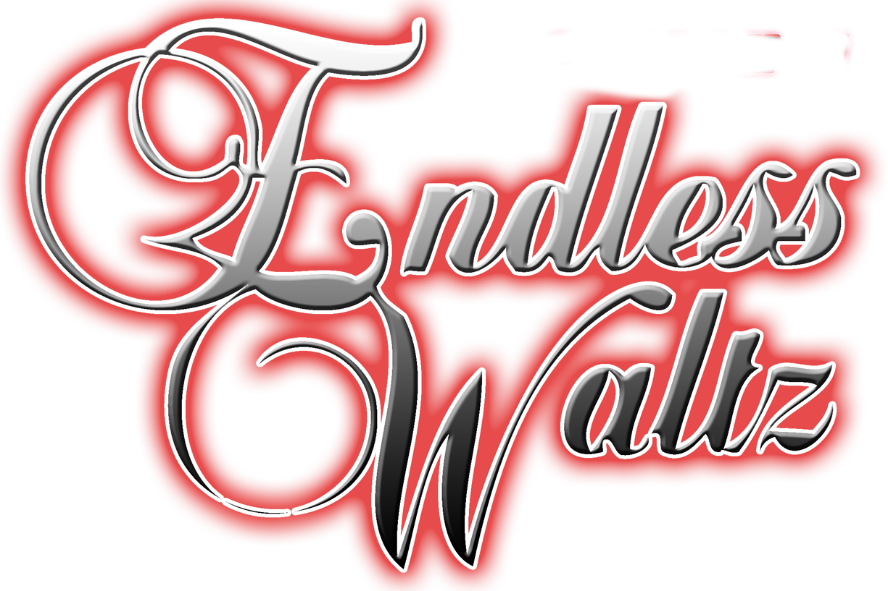

# Endless Waltz
Endless Waltz is a messaging application using a One-Time Pad Cipher in conjunction 
with a Diffie-Hellman handshake to modify pads sent across the open internet.

It cannot be broken by any attacker, now or in the future, including quantum attacks. 

## Issue Submission
For any issues you have with the website or the messenger application, submit an 
issue using the "Issue" tab. We take issues seriously, and will action it quickly. 

## Documentation
User-facing documentation can be found in the "Wiki" tab. If it is incomplete or 
you have more questions, please submit an issue. 
